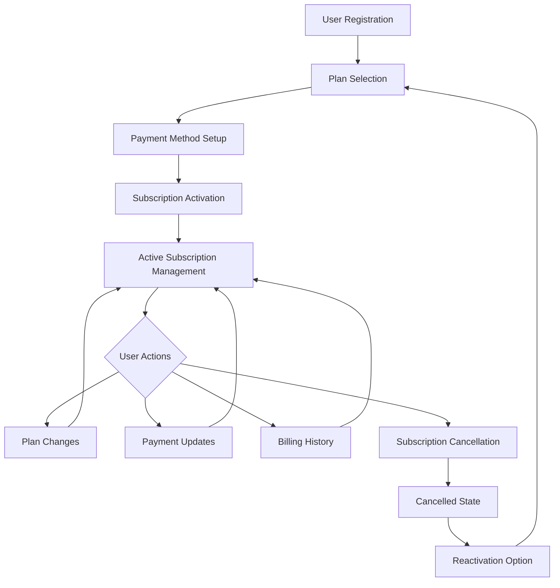
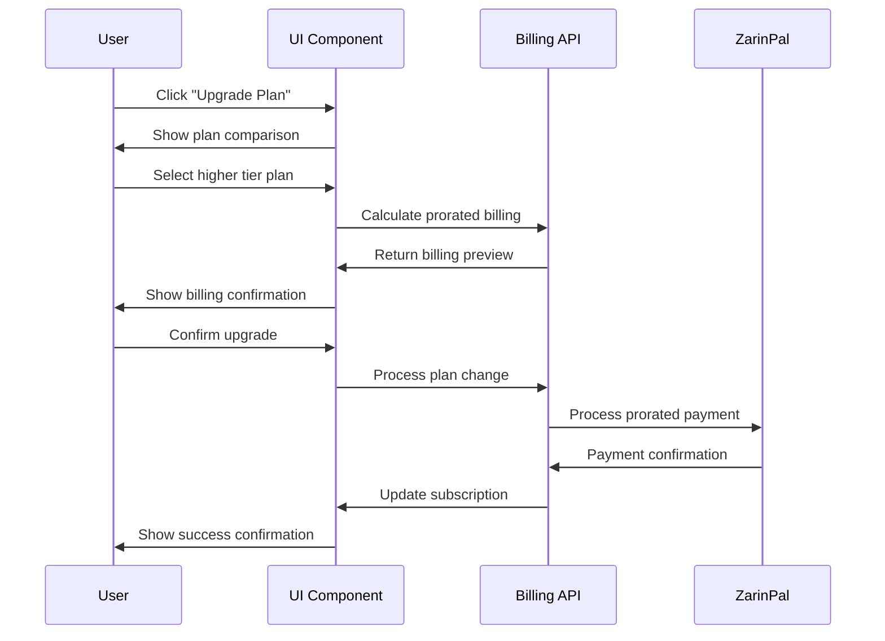
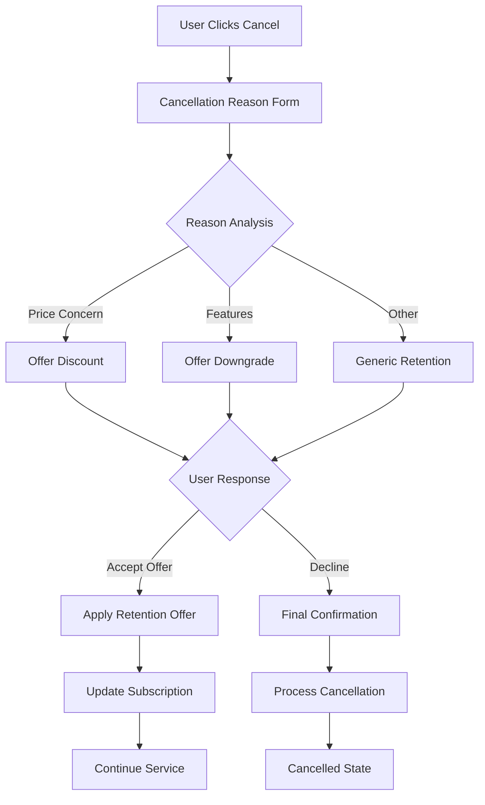

# Complete User Journey Documentation - ZarinPal Billing Dashboard

## Overview

This document outlines the complete user journey for the ZarinPal Billing Dashboard, from initial subscription sign-up through ongoing subscription management. All journeys are designed for Persian-speaking Iranian users with ZarinPal payment integration.

## Journey Map Overview



## Journey 1: New User Subscription Flow

### 1.1 User Registration & Authentication
**Epic Reference**: Existing authentication system
**UI Components**: Login/Register forms with Persian support

**Steps**:
1. User arrives at application
2. Registration/login with existing Better Auth system
3. User profile completion with Persian fields
4. Email verification with Persian templates

**Success Criteria**:
- User successfully authenticated
- Profile information collected
- Persian localization active

### 1.2 Subscription Plan Selection
**Epic Reference**: Epic 5 (Story 5.1)
**UI Components**: Plan comparison table, feature lists
**ZarinPal Reference**: [Subscription Plans Best Practices](https://www.zarinpal.com/docs/subscription/)

**User Interface Flow**:
```
┌─────────────────────────────────────────────────┐
│ انتخاب بسته اشتراک (Subscription Plan Selection) │
├─────────────────────────────────────────────────┤
│ ┌─────────┐ ┌─────────┐ ┌─────────┐ ┌─────────┐ │
│ │  پایه   │ │  نقره  │ │  طلایی  │ │ پلاتین │ │
│ │ ۵۰ تومان│ │۱۰۰ تومان│ │۲۰۰ تومان│ │۵۰۰ تومان│ │
│ │ Base    │ │ Silver  │ │  Gold   │ Platinum │ │
│ └─────────┘ └─────────┘ └─────────┘ └─────────┘ │
│                                                 │
│ مقایسه ویژگی‌ها (Feature Comparison):          │
│ ✓ پشتیبانی 24/7                                │
│ ✓ پردازش نامحدود                               │
│ ✓ گزارش‌گیری پیشرفته                          │
│                                                 │
│ [انتخاب و ادامه] [Compare Plans]                │
└─────────────────────────────────────────────────┘
```

**Implementation Details**:
```typescript
interface SubscriptionPlan {
  id: string;
  namePersian: string;
  nameEnglish: string;
  priceIRR: number;
  priceTMN: number;
  features: PlanFeature[];
  recommended: boolean;
}

const PlanCard = ({ plan, onSelect }: { plan: SubscriptionPlan, onSelect: (plan: SubscriptionPlan) => void }) => (
  <Card className="relative">
    {plan.recommended && (
      <Badge className="absolute -top-2 right-4">پرطرفدار</Badge>
    )}
    <CardHeader>
      <h3 className="text-lg font-bold">{plan.namePersian}</h3>
      <div className="text-2xl font-bold">
        {formatTMN(plan.priceTMN)} تومان
        <span className="text-sm text-gray-500">در ماه</span>
      </div>
    </CardHeader>
    <CardContent>
      <ul className="space-y-2">
        {plan.features.map(feature => (
          <li key={feature.id} className="flex items-center">
            <CheckIcon className="ml-2 h-4 w-4 text-green-500" />
            {feature.namePersian}
          </li>
        ))}
      </ul>
    </CardContent>
    <CardFooter>
      <Button onClick={() => onSelect(plan)} className="w-full">
        انتخاب این بسته
      </Button>
    </CardFooter>
  </Card>
);
```

### 1.3 Payment Method Setup
**Epic Reference**: Epic 4 (Stories 4.1-4.3)
**UI Components**: Card addition form, security indicators
**ZarinPal Reference**: [Direct Debit Implementation](https://www.zarinpal.com/docs/directDebit/)

**User Interface Flow**:
```
┌─────────────────────────────────────────────────┐
│ افزودن کارت بانکی (Add Bank Card)                │
├─────────────────────────────────────────────────┤
│ 🔒 اتصال امن - رمزگذاری 256 بیتی                │
│                                                 │
│ شماره کارت (Card Number):                       │
│ [____-____-____-____]                          │
│                                                 │
│ تاریخ انقضا (Expiry Date):                      │
│ [MM] / [YY]                                     │
│                                                 │
│ نام دارنده کارت (Cardholder Name):              │
│ [_________________________]                    │
│                                                 │
│ CVV2:                                           │
│ [___] ℹ️ کد امنیتی پشت کارت                     │
│                                                 │
│ ☑️ موافقم کارتم برای پرداخت ماهانه ذخیره شود   │
│                                                 │
│ [تأیید و ادامه] [Cancel]                        │
└─────────────────────────────────────────────────┘
```

**ZarinPal Direct Debit Integration**:
```typescript
const addPaymentMethod = async (cardData: CardData) => {
  try {
    // Step 1: Validate card with Iranian banking formats
    const validation = validateIranianBankCard(cardData);
    if (!validation.valid) {
      throw new Error(validation.errorPersian);
    }

    // Step 2: Initialize ZarinPal Direct Debit
    const response = await fetch('/api/billing/direct-debit/initialize', {
      method: 'POST',
      headers: { 'Content-Type': 'application/json' },
      body: JSON.stringify({
        card_number: cardData.number,
        expiry_month: cardData.expiryMonth,
        expiry_year: cardData.expiryYear,
        cardholder_name: cardData.holderName,
        cvv2: cardData.cvv
      })
    });

    const result = await response.json();
    
    if (result.status === 'redirect_required') {
      // Redirect to bank authorization
      window.location.href = result.redirect_url;
    } else if (result.status === 'success') {
      // Card authorized successfully
      showSuccessMessage('کارت شما با موفقیت تأیید شد');
      navigateToSubscriptionConfirmation();
    }
  } catch (error) {
    showErrorMessage(error.message);
  }
};
```

### 1.4 Subscription Activation
**Epic Reference**: Epic 2 (Story 2.2)
**UI Components**: Confirmation screen, welcome message
**ZarinPal Reference**: [Payment Verification](https://www.zarinpal.com/docs/paymentGateway/verify/)

**Flow**:
1. Payment method authorized
2. Initial subscription payment processed
3. Subscription activated in system
4. Welcome email sent in Persian
5. User redirected to dashboard

## Journey 2: Active Subscription Management

### 2.1 Dashboard Overview
**Epic Reference**: Epic 3 (Story 3.2)
**UI Components**: Status cards, quick actions, recent activity

**Dashboard Layout**:
```
┌─────────────────────────────────────────────────┐
│ داشبورد اشتراک (Subscription Dashboard)          │
├─────────────────────────────────────────────────┤
│ ┌─────────────┐ ┌─────────────┐ ┌─────────────┐ │
│ │ بسته فعلی   │ │ پرداخت بعدی│ │ وضعیت حساب │ │
│ │   طلایی     │ │  ۱۵ آذر    │ │    فعال     │ │
│ │ ۲۰۰ تومان   │ │ ۲۰۰ تومان  │ │    ✓       │ │
│ └─────────────┘ └─────────────┘ └─────────────┘ │
│                                                 │
│ عملیات سریع (Quick Actions):                    │
│ [تغییر بسته] [تاریخچه پرداخت] [تنظیمات]         │
│                                                 │
│ آخرین فعالیت‌ها:                                │
│ • پرداخت ماهانه - ۱۵ آبان - موفق                │
│ • تغییر به بسته طلایی - ۱۰ آبان                 │
│ • کارت جدید اضافه شد - ۵ آبان                  │
└─────────────────────────────────────────────────┘
```

### 2.2 Plan Management Journey
**Epic Reference**: Epic 5 (Stories 5.1-5.3)
**UI Components**: Plan comparison, billing preview, confirmation flows

#### 2.2.1 Plan Upgrade Flow


**Billing Preview Component**:
```typescript
interface BillingPreview {
  currentPlan: SubscriptionPlan;
  newPlan: SubscriptionPlan;
  proratedCredit: number;
  additionalCharge: number;
  nextBillingDate: Date;
  effectiveDate: Date;
}

const BillingPreviewCard = ({ preview }: { preview: BillingPreview }) => (
  <Card>
    <CardHeader>
      <h3>پیش‌نمای تغییر بسته</h3>
    </CardHeader>
    <CardContent className="space-y-4">
      <div className="flex justify-between">
        <span>بسته فعلی:</span>
        <span>{preview.currentPlan.namePersian}</span>
      </div>
      <div className="flex justify-between">
        <span>بسته جدید:</span>
        <span className="font-bold">{preview.newPlan.namePersian}</span>
      </div>
      <Separator />
      <div className="flex justify-between">
        <span>اعتبار باقی‌مانده:</span>
        <span className="text-green-600">+{formatTMN(preview.proratedCredit)} تومان</span>
      </div>
      <div className="flex justify-between">
        <span>هزینه اضافی:</span>
        <span className="text-red-600">-{formatTMN(preview.additionalCharge)} تومان</span>
      </div>
      <Separator />
      <div className="flex justify-between font-bold">
        <span>مبلغ قابل پرداخت:</span>
        <span>{formatTMN(preview.additionalCharge - preview.proratedCredit)} تومان</span>
      </div>
      <div className="text-sm text-gray-600">
        تغییرات از {formatPersianDate(preview.effectiveDate)} اعمال می‌شود
      </div>
    </CardContent>
  </Card>
);
```

### 2.3 Payment Method Management Journey
**Epic Reference**: Epic 4 (Stories 4.1-4.3)

#### 2.3.1 Update Payment Method Flow
```
User Journey: Update Expired Card
┌─────────────────────────────────────────────────┐
│ Step 1: Expiration Warning                      │
│ ⚠️ کارت شما در ۳ روز دیگر منقضی می‌شود          │
│ [بروزرسانی کارت] [یادآوری بعداً]                 │
└─────────────────────────────────────────────────┘
          ↓
┌─────────────────────────────────────────────────┐
│ Step 2: Card Update Form                       │
│ کارت فعلی: ****-****-****-1234 (منقضی)         │
│ 🔄 بروزرسانی اطلاعات کارت                     │
│ [تاریخ انقضای جدید] [CVV جدید]                  │
│ [تأیید تغییرات]                                 │
└─────────────────────────────────────────────────┘
          ↓
┌─────────────────────────────────────────────────┐
│ Step 3: Bank Authorization                     │
│ 🏦 انتقال به درگاه بانک برای تأیید              │
│ لطفاً در صفحه بانک اطلاعات را تأیید کنید        │
└─────────────────────────────────────────────────┘
          ↓
┌─────────────────────────────────────────────────┐
│ Step 4: Success Confirmation                   │
│ ✅ کارت شما با موفقیت بروزرسانی شد              │
│ پرداخت بعدی: ۱۵ آذر با کارت جدید               │
└─────────────────────────────────────────────────┘
```

## Journey 3: Billing History & Receipt Management

### 3.1 Transaction History View
**Epic Reference**: Epic 6 (Story 6.1)
**UI Components**: Transaction table, filters, detail modals

**Transaction Table Implementation**:
```typescript
interface Transaction {
  id: string;
  date: Date;
  amount: number;
  status: 'success' | 'failed' | 'pending';
  zarinpalRef: string;
  description: string;
  receiptUrl?: string;
}

const TransactionRow = ({ transaction }: { transaction: Transaction }) => (
  <TableRow>
    <TableCell>
      {formatPersianDate(transaction.date)}
    </TableCell>
    <TableCell>
      {formatTMN(transaction.amount)} تومان
    </TableCell>
    <TableCell>
      <StatusBadge status={transaction.status} />
    </TableCell>
    <TableCell className="font-mono text-sm">
      {transaction.zarinpalRef}
    </TableCell>
    <TableCell>
      <DropdownMenu>
        <DropdownMenuTrigger>
          <MoreHorizontal className="h-4 w-4" />
        </DropdownMenuTrigger>
        <DropdownMenuContent>
          <DropdownMenuItem onClick={() => viewDetails(transaction.id)}>
            مشاهده جزئیات
          </DropdownMenuItem>
          {transaction.receiptUrl && (
            <DropdownMenuItem onClick={() => downloadReceipt(transaction.receiptUrl)}>
              دانلود رسید
            </DropdownMenuItem>
          )}
          {transaction.status === 'failed' && (
            <DropdownMenuItem onClick={() => retryPayment(transaction.id)}>
              تلاش مجدد
            </DropdownMenuItem>
          )}
        </DropdownMenuContent>
      </DropdownMenu>
    </TableCell>
  </TableRow>
);
```

### 3.2 Receipt Generation Journey
**Epic Reference**: Epic 6 (Story 6.2)
**ZarinPal Reference**: [Receipt Requirements](https://www.zarinpal.com/docs/receipt/)

**Persian Receipt Template**:
```typescript
const generatePersianReceipt = async (transaction: Transaction): Promise<Buffer> => {
  const receiptData = {
    companyName: 'شرکت نمونه',
    companyAddress: 'تهران، خیابان ولیعصر',
    transactionId: transaction.zarinpalRef,
    date: formatPersianDate(transaction.date),
    amount: transaction.amount,
    amountWords: numberToWords(transaction.amount, 'fa'),
    customerName: transaction.customerName,
    description: transaction.description,
    status: transaction.status === 'success' ? 'موفق' : 'ناموفق'
  };

  // Generate PDF with Persian RTL layout
  const pdf = await generatePersianPDF(receiptTemplate, receiptData);
  return pdf;
};
```

## Journey 4: Subscription Cancellation & Reactivation

### 4.1 Cancellation Flow with Retention
**Epic Reference**: Epic 5 (Story 5.3)
**UI Components**: Cancellation form, retention offers, confirmation



**Retention Interface**:
```typescript
const RetentionOffer = ({ reason, onAccept, onDecline }: RetentionProps) => {
  const offer = getRetentionOffer(reason);
  
  return (
    <Card className="border-amber-200 bg-amber-50">
      <CardHeader>
        <h3 className="text-xl font-bold">پیشنهاد ویژه برای شما!</h3>
      </CardHeader>
      <CardContent>
        <div className="space-y-4">
          <p>{offer.messagePersian}</p>
          <div className="bg-white p-4 rounded border">
            <div className="text-2xl font-bold text-green-600">
              {offer.discountPercentage}% تخفیف
            </div>
            <p className="text-sm text-gray-600">
              برای {offer.durationMonths} ماه آینده
            </p>
          </div>
        </div>
      </CardContent>
      <CardFooter className="gap-2">
        <Button onClick={() => onAccept(offer)} className="flex-1">
          پذیرفتن پیشنهاد
        </Button>
        <Button variant="outline" onClick={onDecline} className="flex-1">
          ادامه لغو اشتراک
        </Button>
      </CardFooter>
    </Card>
  );
};
```

### 4.2 Reactivation Journey
**User Flow**: Cancelled user returns and wants to reactivate

```
┌─────────────────────────────────────────────────┐
│ اشتراک شما لغو شده است                          │
│ آخرین بسته: طلایی (لغو شده در ۱۰ آذر)          │
│                                                 │
│ برای فعال‌سازی مجدد اشتراک:                     │
│ • انتخاب بسته جدید                             │
│ • تأیید روش پرداخت                             │
│ • شروع فوری سرویس                              │
│                                                 │
│ [فعال‌سازی مجدد] [مقایسه بسته‌ها]               │
└─────────────────────────────────────────────────┘
```

## Implementation Architecture

### Frontend Stack
- **Framework**: Next.js 15.3.2 with App Router
- **UI Library**: Shadcn/UI with RTL modifications  
- **Styling**: Tailwind CSS with RTL support
- **Forms**: React Hook Form with Zod validation
- **State Management**: Zustand for billing state
- **Internationalization**: next-intl with Persian locale

### Backend Integration Points
- **Authentication**: Better Auth integration
- **Database**: Drizzle ORM with Cloudflare D1
- **Payment Processing**: ZarinPal API integration
- **Background Jobs**: Cloudflare Workers Cron
- **Email**: React Email with Persian templates

### ZarinPal Integration Architecture
```typescript
// ZarinPal Client Configuration
class ZarinPalClient {
  private baseURL: string;
  private merchantId: string;
  
  constructor() {
    this.baseURL = process.env.NODE_ENV === 'production' 
      ? 'https://api.zarinpal.com/pg/v4'
      : 'https://sandbox.zarinpal.com/pg/v4';
    this.merchantId = process.env.ZARINPAL_MERCHANT_ID!;
  }

  async initializePayment(params: PaymentParams): Promise<PaymentResponse> {
    // Implementation following ZarinPal docs
  }

  async verifyPayment(authority: string, amount: number): Promise<VerificationResponse> {
    // Implementation following ZarinPal docs
  }

  async setupDirectDebit(params: DirectDebitParams): Promise<DirectDebitResponse> {
    // Implementation following ZarinPal docs
  }
}
```

## Quality Assurance & Testing

### User Journey Testing Checklist
- [ ] **Happy Path Testing**: All journeys complete successfully
- [ ] **Error Handling**: Graceful failure handling with Persian messages
- [ ] **Persian Localization**: All text properly localized and culturally appropriate
- [ ] **RTL Layout**: Proper right-to-left layout across all components
- [ ] **Iranian Banking**: ZarinPal integration working with various Iranian banks
- [ ] **Mobile Responsiveness**: All journeys work on mobile devices
- [ ] **Performance**: Fast loading times for Iranian network conditions
- [ ] **Accessibility**: Screen reader compatibility with Persian content

This comprehensive documentation ensures proper implementation of all user journeys with ZarinPal integration and Iranian market compliance.